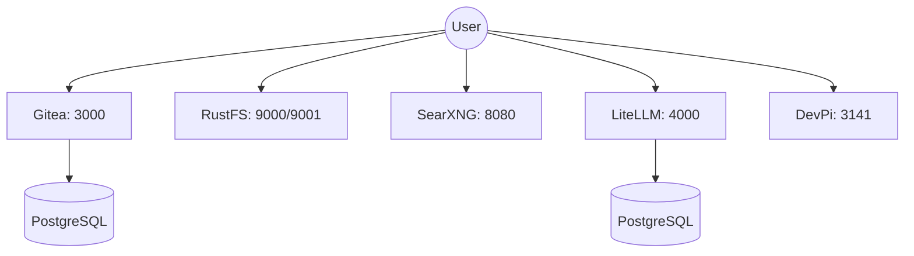

# PersonalCloud

A comprehensive, self-hosted suite of personal cloud resources deployed via Docker. This project integrates several essential services into a single, manageable infrastructure.

## 🏗️ Infrastructure Overview

The system consists of multiple standalone services, each exposed on its own port for direct access.



- **Persistence**: Each service utilizes Docker volumes to ensure data persistence across restarts and updates.
- **Networking**: Services are deployed in a containerized environment, with specific ports mapped to the host machine.

## ✨ Features

| Service | Purpose | Port | Default Config Path |
| :--- | :--- | :--- | :--- |
| **Gitea** | Lightweight self-hosted Git service | `3000` | Internal/Env |
| **RustFS** | High-performance object storage | `9000` (API), `9001` (Console) | Internal/Env |
| **SearXNG** | Privacy-respecting metasearch engine | `8080` | `/searxng/settings.yml` |
| **LiteLLM** | Unified LLM API proxy | `4000` | `/litellm/config.yaml` |
| **DevPi** | Private PyPI mirror and index | `3141` | Internal/Env |

## 🚀 Getting Started

### Prerequisites
- Docker and Docker Compose installed on your system.

### Installation

1. **Clone the repository:**
   ```bash
   git clone https://github.com/jacobrenn/PersonalCloud
   cd PersonalCloud
   ```

2. **Configure environment variables:**
   Copy the example environment file and fill in the required secrets.
   ```bash
   cp env.example .env
   ```

3. **Deploy the services:**
   ```bash
   docker compose up -d
   ```

### Networking & Access
All services are exposed directly on their respective ports. Ensure your firewall allows traffic on the ports listed in the Features table.

## ⚙️ Configuration

### Environment Variables (`.env`)
| Variable | Description |
| :--- | :--- |
| `GITEA_DB_PASSWORD` | Password for the Gitea database. |
| `RUSTFS_ACCESS_KEY` | Access key for RustFS authentication. |
| `RUSTFS_SECRET_KEY` | Secret key for RustFS authentication. |
| `LITELLM_MASTER_KEY` | The master key used to authenticate requests to the LiteLLM proxy. |
| `DEVPI_PASSWORD` | Administrative password for the DevPi server. |

### Service Settings
- **SearXNG**: Settings can be modified in `/searxng/settings.yml`.
- **LiteLLM**: API configurations are managed in `/litellm/config.yaml`.

## 🛠️ Maintenance & Operations

### Updating the Stack
To pull the latest images and restart the services:
```bash
docker compose pull
docker compose up -d
```

### Monitoring Logs
If a service is acting up, check the logs:
```bash
# View logs for all services
docker compose logs -f

# View logs for a specific service (e.g., gitea)
docker compose logs -f gitea
```

### Backups
Data is stored in Docker volumes. To back up your data, you can archive the volume directories or use `docker run` to create a tarball of the volume contents.
Check `docker volume ls` to see the active volumes.
