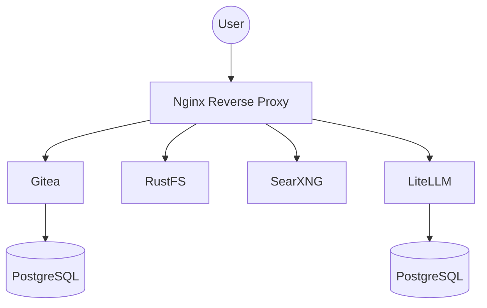

# PersonalCloud

A comprehensive, self-hosted suite of personal cloud resources deployed via Docker. This project integrates several essential services into a single, manageable infrastructure, routed through a centralized Nginx reverse proxy.

## 🏗️ Infrastructure Overview

The system uses a hub-and-spoke network model where Nginx acts as the central gateway.



- **Reverse Proxy**: All services are accessible via Nginx, which handles the traffic distribution.
- **Persistence**: Each service utilizes Docker volumes to ensure data persistence across restarts and updates.
- **Networking**: Isolated Docker networks are used for service-specific communication and a shared `proxy` network for external access.

## ✨ Features

| Service | Purpose | Default Config Path |
| :--- | :--- | :--- |
| **Gitea** | Lightweight self-hosted Git service | Internal/Env |
| **RustFS** | High-performance object storage | Internal/Env |
| **SearXNG** | Privacy-respecting metasearch engine | `/searxng/settings.yml` |
| **LiteLLM** | Unified LLM API proxy | `/litellm/config.yaml` |
| **Nginx** | Centralized reverse proxy | `/nginx/nginx.conf` |

## 🚀 Getting Started

### Prerequisites
- Docker and Docker Compose installed on your system.

### Installation

1. **Clone the repository:**
   ```bash
   git clone https://github.com/jacobrenn/PersonalCloud
   cd PersonalCloud
   ```

2. **Configure environment variables:**
   Copy the example environment file and fill in the required secrets.
   ```bash
   cp env.example .env
   ```

3. **Deploy the services:**
   ```bash
   docker compose up -d
   ```

### Networking & Access
Since this setup uses a reverse proxy, you need to ensure your requests reach the Nginx container.
- **Host Access**: By default, Nginx listens on port `80`.
- **DNS/Hosts**: To use custom domains (e.g., `gitea.local`), add your server's IP address to your local `/etc/hosts` or DNS provider.
- **Ports**: Ensure port `80` (and `443` if you enable SSL) is open on your firewall.

## ⚙️ Configuration

### Environment Variables (`.env`)
| Variable | Description |
| :--- | :--- |
| `GITEA_DB_PASSWORD` | Password for the Gitea database. |
| `RUSTFS_ACCESS_KEY` | Access key for RustFS authentication. |
| `RUSTFS_SECRET_KEY` | Secret key for RustFS authentication. |
| `LITELLM_MASTER_KEY` | The master key used to authenticate requests to the LiteLLM proxy. |

### Service Settings
- **Nginx**: Configuration files are located in the `/nginx` directory. Modify `nginx.conf` to change routing rules.
- **SearXNG**: Settings can be modified in `/searxng/settings.yml`.
- **LiteLLM**: API configurations are managed in `/litellm/config.yaml`.

## 🛠️ Maintenance & Operations

### Updating the Stack
To pull the latest images and restart the services:
```bash
docker compose pull
docker compose up -d
```

### Monitoring Logs
If a service is acting up, check the logs:
```bash
# View logs for all services
docker compose logs -f

# View logs for a specific service (e.g., nginx)
docker compose logs -f nginx
```

### Backups
Data is stored in Docker volumes. To back up your data, you can archive the volume directories or use `docker run` to create a tarball of the volume contents. 
Check `docker volume ls` to see the active volumes.
